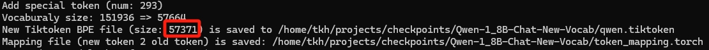

# Qwen-Tokenizer-Pruner(under construction)
Due to the huge vocaburary size (151,936) of Qwen models, the Embedding and LM Head weights are excessively heavy. Therefore, this project provides a Tokenizer vocabulary shearing solution for Qwen and Qwen-VL.

**If my open source projects have inspired you, giving me some sponsorship will be a great help to my subsequent open source work.** 
[Support my subsequent open source work❤️🙏](https://kaihuatang.github.io/donate.html) [(Previous Supporters)](https://kaihuatang.github.io/supporters.html)

## Installation
Run the following command to install required packages
```
pip install -r requirements.txt
```

## Supported Models
This tokenizer vocabulary pruning tool supports the following LLM models.
- [Qwen](https://huggingface.co/collections/Qwen/qwen-65c0e50c3f1ab89cb8704144)
- [Qwen-VL](https://huggingface.co/Qwen/Qwen-VL)
- [Qwen-VL-Chat](https://huggingface.co/Qwen/Qwen-VL-Chat)

Please download your base model from the above checkpoints.

## Getting Started
We support two types of tokenizer vocabulary pruning: lossless (in support data) and lossy (to a target size)

### 1. Lossless Pruning
To conduct lossless vocabulary pruning, you just need to simply run the following script with your own data/model pathes.
```
bash prune_lossless.sh
```
The script will first prune the vocabulary and save it to the output path, and then check whether old tokenizer and new tokenzer are equivalent.

Explaination of arguments used in the script
```
old_model_path="../../checkpoints/Qwen-VL-Chat/"
new_model_path="../../checkpoints/Qwen-VL-Chat-new-vocab/"
support_data="../../VLMEvalKit/raw_data/"
support_lang="" # optional   e.g., support_lang="zh-cn en"
inherit_vocab_count="" # optional
```

### 2. Lossy Pruning


### 3. Other details and special cases:
- For support_lang, note that language detection is using [langdetect](https://pypi.org/project/langdetect/) package, please using the valid abbreviations of languages.
- Post processing
For Qwen models, change SPECIAL_START_ID in tokenization_qwen.py to your New Tiktoken BPE file Size, check printed log (see the following example). 



## Prepare Your Own Target Dataset

## License and Citation
