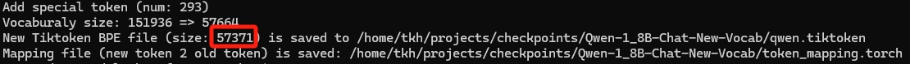

<p align="left">
    中文</a>&nbsp ｜ &nbsp<a href="README.md">English</a>&nbsp
</p>

中文版说明由ChatGPT-4o翻译并由人工校验。

# Qwen-Tokenizer-Pruner
由于 Qwen 模型的词汇量巨大（151,936），其嵌入层和语言模型头部的权重过于庞大。因此在部署中往往造成过大的开销，本项目为 Qwen 和 Qwen-VL 提供了一个分词器词汇表修剪方案。

**如果我的开源项目给您带来了启发，提供一些赞助将对我后续的开源工作有很大的帮助。** 
[支持我的后续开源工作❤️🙏](https://kaihuatang.github.io/donate.html) [(往期支持者)](https://kaihuatang.github.io/supporters.html)


## Contents
1. [安装](#安装)
2. [支持的模型](#支持的模型)
3. [入门使用指南](#入门使用指南)
    - [1. 无损修剪](#1-无损修剪)
    - [2. 有损修剪](#2-有损修剪)
    - [3. 其他细节和特殊情况](#3-其他细节和特殊情况)
4. [准备您自己的支持数据集](#准备您自己的支持数据集)
5. [引用](#引用)


## 安装
执行下面命令来安装本项目所需的软件包
```
pip install -r requirements.txt
```

## 支持的模型
本分词器词汇表修剪工具支持以下大语言模型 (LLM)：
- [Qwen-系列](https://huggingface.co/collections/Qwen/qwen-65c0e50c3f1ab89cb8704144)
- [Qwen-VL](https://huggingface.co/Qwen/Qwen-VL)
- [Qwen-VL-Chat](https://huggingface.co/Qwen/Qwen-VL-Chat)

请下载上述模型的权重和代码作为您的基础模型。

## 入门使用指南
我们支持两种类型的分词器词汇表修剪：无损修剪（在支持数据中无损）和有损修剪（达到固定目标词汇表大小）。

### 1. 无损修剪
要进行无损词汇表修剪，您只需使用您的数据/模型路径运行以下脚本：
```
bash prune_lossless.sh
```
该脚本将首先修剪词汇表并将其保存到输出路径，然后检查旧的分词器和新的分词器是否等效。

脚本中参数的解释：
```
old_model_path="../../checkpoints/Qwen-VL-Chat/"           # 旧模型路径
new_model_path="../../checkpoints/Qwen-VL-Chat-new-vocab/" # 新模型保存路径
support_data="../../VLMEvalKit/raw_data/"                  # 支持数据路径
support_lang="" # 可选（使用 "langdetect"）  例如：support_lang="zh-cn en"
inherit_vocab_count="" # 可选
```

### 2. 有损修剪
运行以下 bash 脚本可以对词汇表进行有损修剪至目标大小：
```
bash prune_lossy.sh
```
此脚本添加了一个参数 'target_size'，该参数会删除使用频率较低的词元，从而导致旧的分词器和新的分词器之间的不匹配。因此，它将不再进行等效性检查。


### 3. 其他细节和特殊情况
- 关于 support_lang 参数，请注意语言检测使用的是 [langdetect](https://pypi.org/project/langdetect/) 包，请参考改包的说明使用有效的语言缩写。
- 后处理
对于 Qwen 模型，请将 tokenization_qwen.py 中的 SPECIAL_START_ID 更改为您的新 Tiktoken BPE 文件大小，并检查打印的日志（参见以下示例）： 



## 准备您自己的支持数据集
我们在 ./sample_data/x.json 中提供了一份示例数据，作为词汇表修剪中使用的支持数据的示例。每个文件要么是由问题和回答组成的字典，要么是纯文本的字典。

支持数据形式A:
```
{
    "query": Picture 1: /YOUR_OWN_PATH/MMBench/demo.jpg</img>\nWhat is in the image? (This query will be tokenized with system prompt)",
    "response": "A white cat. (This response will be directly tokenized from plain text)"
}
```

支持数据形式B:
```
{
    "prompt": "In the heart of the open sky, Where the winds of change freely sigh, A soul finds its endless flight, In the boundless realms of light.(This prompt will be directly tokenized from plain text)"
}
```

## 引用
如果您发现此项目对您的研究有所帮助，请考虑在您的论文中引用我们的项目。
```
@misc{tang2024tokenizerpruner,
    title = {Qwen Tokenizer Pruner},
    author = {Tang, Kaihua},
    year = {2024},
    note = {\url{https://github.com/KaihuaTang/Qwen-Tokenizer-Pruner}},
}
```